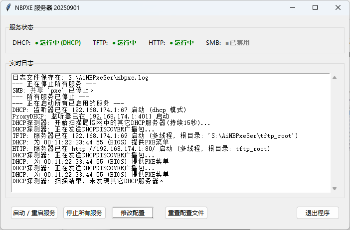

# NBpxeserver

**中文:** `图形化PXE服务器，原生支持类dnsmasq动态菜单，兼容BIOS与UEFI。`  
**English:** `A graphical PXE server with native support for dnsmasq-style dynamic menus, compatible with both BIOS and UEFI.`

---

*（建议在此处替换为您软件的截图 | Recommended to replace this with a screenshot of your software）*

## 📖 简介 | About The Project

**中文:**
NBpxeserver 是一款用 Python 编写的、功能强大的PXE网络启动服务器，它拥有直观的图形用户界面（GUI），旨在将复杂的网络启动配置过程变得简单化、可视化。无论您是需要批量部署操作系统的系统管理员，还是希望通过网络运行各种维护工具的技术爱好者，NBpxeserver 都能帮助您轻松、快速地搭建起一套稳定可靠的PXE启动环境。

**English:**
NBpxeserver is a powerful PXE network boot server written in Python, featuring an intuitive Graphical User Interface (GUI). It is designed to simplify and visualize the complex process of configuring a network boot environment. Whether you are a system administrator needing to deploy operating systems in bulk, or a tech enthusiast looking to run various maintenance tools over the network, NBpxeserver helps you build a stable and reliable PXE boot solution with ease and speed.

## ✨ 主要功能 | Key Features

*   **图形用户界面 (GUI)**
    *   **中文:** 所有核心功能都集成在简洁的图形界面中，无需编辑复杂的配置文件，点击鼠标即可完成设置。
    *   **English:** All core functions are integrated into a clean GUI. No more editing complex configuration files; everything is just a click away.

*   **全面的启动支持 (Comprehensive Boot Support)**
    *   **中文:**完美兼容传统的 **BIOS (Legacy)** 和现代的 **UEFI** 固件，能自动识别客户端类型并发送对应的启动文件。
    *   **English:** Flawlessly compatible with both traditional **BIOS (Legacy)** and modern **UEFI** firmware. It automatically detects the client type and sends the appropriate boot files.

*   **类 Dnsmasq 动态菜单 (Dnsmasq-style Dynamic Menus)**
    *   **中文:** 核心亮点功能。服务器能够像 Dnsmasq 一样，根据客户端的 MAC 地址、UUID 或其他标识动态生成专属的PXE启动菜单，实现高度定制化的启动服务。
    *   **English:** A core highlight feature. The server can dynamically generate specific PXE boot menus for different clients based on their MAC address, UUID, or other identifiers, just like Dnsmasq, enabling highly customized boot services.

*   **多启动加载器支持 (Multi-bootloader Support)**
    *   **中文:** 内置支持 iPXE, GRUB4DOS, Syslinux 等多种流行的启动加载器，您可以根据需求灵活选择。
    *   **English:** Built-in support for multiple popular bootloaders like iPXE, GRUB4DOS, Syslinux, etc. You can choose the one that best fits your needs.

*   **轻量化与便携 (Lightweight & Portable)**
    *   **中文:** 基于 Python 编写，核心服务是单个脚本文件，无需安装，稍作配置即可运行，非常便携。
    *   **English:** Written in Python with a single script file as its core service. It requires no installation, is highly portable, and can be run after minimal configuration.

*   **专为 Windows 设计 (Windows-Friendly)**
    *   **中文:** 完美适配 Windows 操作系统，提供简单易用的启动/停止服务控制。
    *   **English:** Perfectly adapted for the Windows OS, providing easy-to-use controls for starting and stopping the services.

## 🚀 快速上手 | Getting Started

**中文:**
按照以下步骤，您可以在几分钟内启动并运行您的PXE服务器。

**English:**
Follow these steps to get your PXE server up and running in minutes.

1.  **准备环境 (Prepare the Environment)**
    *   **中文:** 确保您的电脑上安装了 Python 3。
    *   **English:** Make sure you have Python 3 installed on your computer.

2.  **下载项目 (Download the Project)**
    *   **中文:** 下载本项目所有文件，并解压到一个文件夹中，例如 `S:\AiNBPxeSer`。
    *   **English:** Download all project files and extract them to a folder, for example, `S:\AiNBPxeSer`.

3.  **配置目录 (Configure Directories)**
    *   **中文:** 将您的启动文件（如 WIM, ISO, 镜像文件等）放入 `tftp_root` 或 `http_root` 文件夹中。服务器会通过 TFTP 或 HTTP 协议将这些文件传输给客户端。
    *   **English:** Place your boot files (like WIMs, ISOs, disk images, etc.) into the `tftp_root` or `http_root` directories. The server will transfer these files to clients via the TFTP or HTTP protocols.

4.  **运行服务器 (Run the Server)**
    *   **中文:**
        1.  直接运行 `ui.py` 文件。
        2.  在图形界面中，程序会自动检测并填入本机IP地址作为服务器地址，您也可以手动指定。
        3.  根据您的网络环境，选择 `DHCP` 模式或 `ProxyDHCP` 模式。
        4.  点击 **“启动服务”** 按钮。
        5.  观察日志窗口，确保服务已成功启动。
    *   **English:**
        1.  Run the `ui.py` script directly.
        2.  In the GUI, the application will automatically detect and fill in the local IP as the server address, which you can also set manually.
        3.  Choose between `DHCP` mode or `ProxyDHCP` mode based on your network environment.
        4.  Click the **"Start Server"** button.
        5.  Check the log window to ensure all services have started successfully.

5.  **客户端启动 (Client Boot)**
    *   **中文:** 将需要启动的客户端电脑（裸机或虚拟机）设置为从网络 (PXE / Network Boot) 启动，如果一切正常，您将看到由服务器发送的启动菜单。
    *   **English:** Set the client computer (bare metal or VM) to boot from the network (PXE / Network Boot). If everything is configured correctly, you will see the boot menu sent by the server.

## 📜 开源协议 | License

Distributed under the MIT License. See `LICENSE` for more information.

## 🙏 致谢 | Acknowledgments

*   [Python](https.python.org)
*   [Dnsmasq](https://thekelleys.org.uk/dnsmasq/doc.html)
*   [iPXE](https://ipxe.org/)
*   [GRUB4DOS](https://github.com/chenall/grub4dos)
*   以及所有为开源社区做出贡献的开发者。
*   And all developers who contribute to the open-source community.

---

## 声明 | Declaration

**中文:**  
郑重声明：本项目的全部代码均由 Google AI 编写。作者本人在此过程中的全部工作，是使用一个仅包含三个按键（`Ctrl`, `C`, `V`）的特制键盘完成的。

**English:**  
Full disclosure: This entire project was coded by Google AI. The author's role was limited to using a highly specialized three-key keyboard consisting of only `CTRL`, `C`, and `V`.

---
